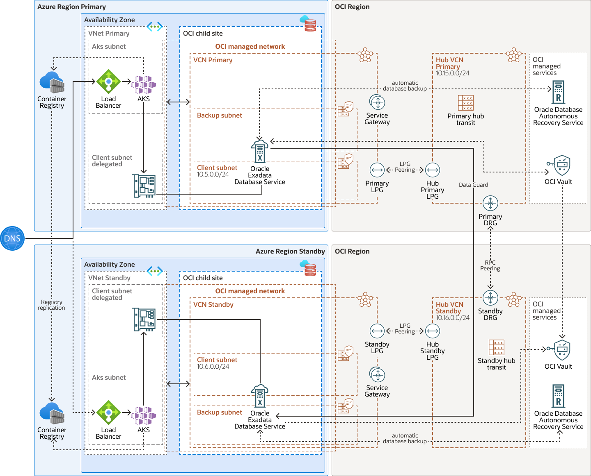

# Automating the OCI Networking Layer for Exadata Database@Azure Cross-Region DR

This repository contains a focused automation bundle for the OCI networking layer of cross-region disaster recovery for Exadata Database on Oracle Database@Azure.

The key point is the word *focused*.

The scripts do not attempt to provision the database, configure Data Guard, manage backups, create compute, or automate application failover. They are built specifically to implement the OCI networking tasks required to connect a primary-region Exadata environment to a standby-region Exadata environment using the hub VCN, LPG, DRG, and RPC pattern from the Oracle reference architecture.

## Architecture diagram

## Why this bundle exists

The reference architecture is clear, but the implementation has enough steps that it is easy to miss something when working manually:

- create a hub VCN in each region
- create the local peering gateways in the Exadata and hub VCNs
- peer the LPGs in each region
- create the DRGs
- attach each hub VCN to its DRG
- create the remote peering connections
- peer the DRGs across regions
- update the Exadata, hub, and DRG route tables
- create NSGs for cross-region database access

Those steps are individually simple. Together, they become repetitive and error-prone.

This bundle turns that sequence into a repeatable Cloud Shell workflow.

## What the setup script does

The main entry point is `setup_exadb_dr_network.sh`.

It reads `exadb_dr_network.conf` from the same folder, validates the required values, confirms that the primary and standby Exadata VCNs exist in the expected compartments, and discovers the client and backup subnets from the configured CIDRs.

From there, it:

- resolves or auto-selects hub VCN CIDRs
- creates the hub VCNs
- creates hub route tables
- creates the LPGs
- peers the LPGs in both regions
- creates the DRGs
- creates and peers the remote peering connections
- updates route tables so local and remote traffic flows through the right OCI components
- creates NSGs in the Exadata VCNs
- optionally adds listener and SSH rules based on the config
- writes a timestamped state file for rollback

The script is designed to log every major step and to fail early when required configuration is missing or inconsistent.

## What the rollback script does

The rollback entry point is `rollback_exadb_dr_network.sh`.

It uses the most recent state file by default, or it can take a specific state file path as an argument. The script is designed to behave safely after both successful and partial setup runs.

It removes:

- route rules added to existing Exadata route tables
- route rules added to hub route tables
- DRG route rules added by setup
- created NSGs
- created remote peering connections
- created DRG attachments
- created LPGs
- created hub route tables
- created DRGs
- created hub VCNs

The goal is straightforward: remove only what setup created and skip anything that is already gone.

## Files in this bundle

- `exadb_dr_network.conf`
- `setup_exadb_dr_network.sh`
- `rollback_exadb_dr_network.sh`

Runtime artifacts:

- `exadb_dr_network.log`
- `exadb_dr_network_state_<timestamp>.env`

## Configuration model

The configuration file is intentionally simple and split into clear sections:

- `primary_region_configuration`
- `standby_region_configuration`
- `hub_vcn_configuration`
- `database_listener_configuration`
- `global_optional_configuration`

The required inputs cover the two regions, the two compartments, the two Exadata VCN OCIDs, and the client and backup subnet CIDRs on each side.

Optional inputs let you:

- provide explicit hub VCN CIDRs
- allow the script to auto-pick safe `/29` hub CIDRs
- define optional TCP and TCPS listener ports for NSG rules
- optionally allow SSH
- set a naming prefix for created OCI resources

## Where this bundle fits

There are three common ways to implement this architecture:

1. manually in the OCI Web UI
2. with Terraform
3. with this OCI Cloud Shell bundle

The Web UI is useful when you want to learn the topology and follow each OCI object directly in the console.

Terraform is a strong choice when you want infrastructure as code and your team already has a Terraform operating model.

This bundle is the practical middle path. It keeps the implementation close to the OCI reference design while making the deployment repeatable, easier to validate, and easier to roll back.

## When to use this repository

This bundle is a good fit when:

- you want to stay inside OCI Cloud Shell
- you need to automate only the OCI networking layer
- you want a lightweight operational model with no external dependencies
- you need a rollback-aware implementation path
- you want something easier to hand over than a long manual runbook

## Suggested usage flow

1. Edit `exadb_dr_network.conf`.
2. Make both scripts executable.
3. Run `./setup_exadb_dr_network.sh`.
4. Validate LPG peering, RPC peering, route tables, and NSGs.
5. If needed, run `./rollback_exadb_dr_network.sh`.

## Final thought

Cross-region DR depends on more than the database configuration alone. The OCI networking path has to be built correctly, verified carefully, and cleaned up safely when changes are needed.

That is exactly the problem this repository is meant to solve.

THE SOFTWARE IS PROVIDED "AS IS", WITHOUT WARRANTY OF ANY KIND, EXPRESS OR
IMPLIED, INCLUDING BUT NOT LIMITED TO THE WARRANTIES OF MERCHANTABILITY,
FITNESS FOR A PARTICULAR PURPOSE AND NONINFRINGEMENT. IN NO EVENT SHALL THE
AUTHORS OR COPYRIGHT HOLDERS BE LIABLE FOR ANY CLAIM, DAMAGES OR OTHER
LIABILITY, WHETHER IN AN ACTION OF CONTRACT, TORT OR OTHERWISE, ARISING FROM,
OUT OF OR IN CONNECTION WITH THE SOFTWARE OR THE USE OR OTHER DEALINGS IN THE
SOFTWARE.
